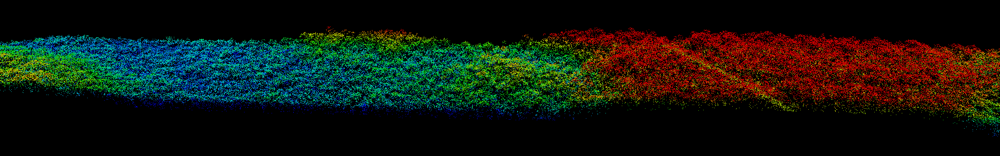

# pyLiDARForest

This repository contains a bunch of Python routines to process LiDAR data collected in forestry.

Some notes about it:

1) The library is developed and tested using Python 2.7 in an Anaconda Windows version environment, 64 bits. You can try it in another environments, and fell free to contact me if you have any issue that you think I could fix. 

2) Some routines use [laspy](https://www.visualstudio.com/en-us/features/python-vs.aspx), a Python library that provides access to LAS files. So, you should install laspy before use.

3) The routines are based in some "science" Python libraries, like numpy and scipy. You can install it in your Python environment, but I suggest you install and use [Anaconda](https://www.continuum.io/downloads), a Python environment including many libraries to deal with math & science, and of course, numpy & scipy.

4) Validation routines will also use [Fusion](http://forsys.cfr.washington.edu/fusion.html) and [LASTools](https://rapidlasso.com/lastools/). You should download and install it before use Validate.py. There´s a file called valParameters.py where you can set the paths to those softwares, if you don´t install it at default path.

5) I´m using Visual Studio as editor, the solution file is pyLiDARForest.sln. To use it, you can download and install any version of Visual Studio, including [Community Edition](https://www.visualstudio.com/en-us/products/visual-studio-community-vs.aspx), that´s free, and then install [Python Tools for Visual Studio](https://www.visualstudio.com/en-us/products/visual-studio-community-vs.aspx).
Of course, you can use any editor you want, the libraries will work nicely.
## Documentation
Files are documented using [Docstring]( https://en.wikipedia.org/wiki/Docstring) style, which means that the routines are documented inside the source code. For each module there is a short description in a md (text) file, and when you need to dig on the more specific information you can check docstrings in source code (they are the blocs between ‘’’)
For those files that can be executed from command line, you have also the option –h, that will describe shortly the command line options available, for example:

python lasutils.py –h

    usage: lidarutils.py [-h] -t {p,b,d,e,s,t,f,pxy,py} [-o OUTPUTFNAME]
                     [-c CELLSIZE] [-n NUMBEROFCELLS] [-f FLOOR] [-sn NSLICES]
                     [-sb PERCBOTTOM] [-st PERCTOP] [-p PERCENT] [-v VERBOSE]
                     inputfname

    Some useful features to deal with LiDAR files.

    positional arguments:
      inputfname            las file to be process.

    optional arguments:
      -h, --help            show this help message and exit
      -t {p,b,d,e,s,t,f,pxy,py}, --task {p,b,d,e,s,t,f,pxy,py}
                        
                        Define task to be done.
                          'd' display information about LAS file.
                          'f' create new file with z coord = floor parameter
                          't' create one slice from top, with p percent 
                          'b' create one slice from bottom, with p percent 
                          'p' split LAS file generating cellsize squared or numerofcells clouds.
                          's' slices file in 'ns' slices, or get a slice excluding percbottom and perctop
                          'e' export LAS points to csv file.
                          'py' project all points to min y
                          'pxy' project all points to min x, min y 
                                
      -o OUTPUTFNAME, --outputfname OUTPUTFNAME
                        output file name.

      -c CELLSIZE, --cellsize CELLSIZE
                        size of the cells that will be processed.

      -n NUMBEROFCELLS, --numberofcells NUMBEROFCELLS
                        amount of cells.

      -f FLOOR, --floor FLOOR
                        floor value for toFloor function

      -sn NSLICES, --nslices NSLICES
                        number of slices

      -sb PERCBOTTOM, --percbottom PERCBOTTOM
                        percentual to be excluded in bottom

      -st PERCTOP, --perctop PERCTOP
                        percentual to be excluded on top

      -p PERCENT, --percent PERCENT
                        percent value for t or b function

      -v VERBOSE, --verbose VERBOSE
                        show processing messages.

##Libraries & programs

**[lidarUtils.py](lidarutils/lidarutils.md)**
Support routines to process LAS files

**CheckDirFileStruct.py**
Check if a group of files exists in a dir structure

**Validate.py**
Class that validates a LAS file checking some parameters and values. 

**ValidateLAS.py**
Program that uses Validate.py to validate a group of LAS files (multithread)

**valParameters.py**
Parameters to be used in Validate.
